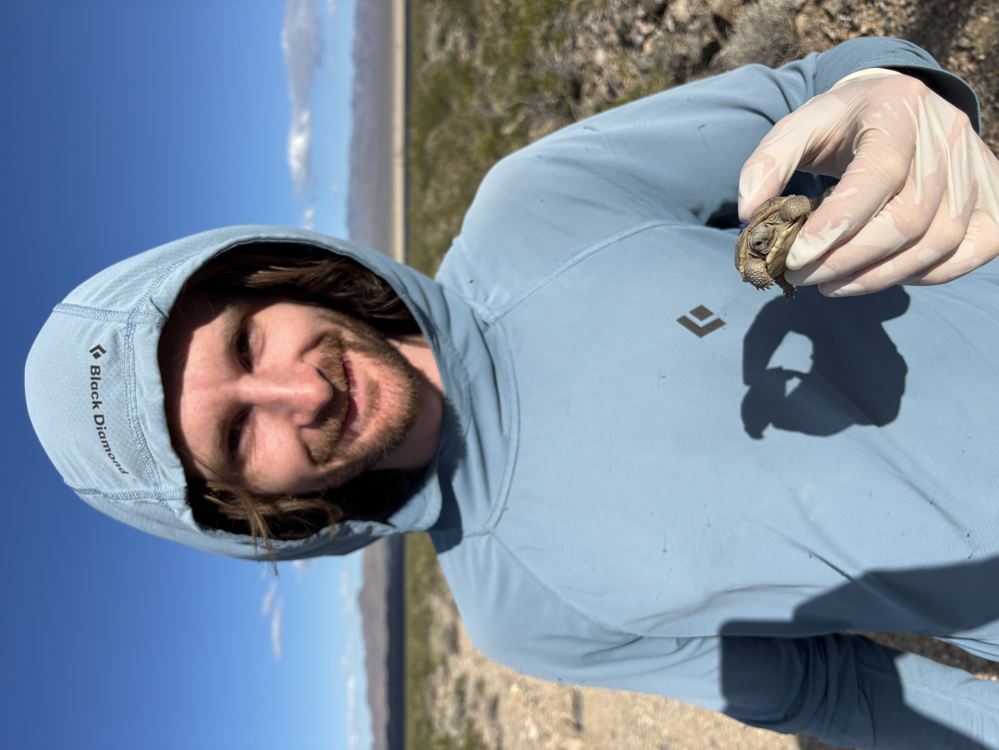

Ph.D. Student | Ecology, Evolution and Conservation Biology
<br>
University of Nevada, Reno
<br>
Last Updated: `r Sys.Date()`
<br>
<br>
```{r, echo=FALSE, fig.align='center', out.width='40%', fig.cap='Harrison York holding a hatchling *G. agassizii*'}

```

<br>
I am Ph.D. Student at the University of Nevada, Reno studying the ecology and conservation of Mojave Desert Tortoise (*Gopherus agassizii*). My current research uses spatial agent-based-modeling to conduct a range-wide simulation of Tortoise populations to better understand how climate change, development, and varying survival across life-stages can affect population viability, connectivity, and gene flow. I also study community ecology in the Mojave Desert, specifically, how fluctuations in prey populations and drought lead a preeminent subsidized predator to exhibit prey switching behavior at the expense of the desert tortoise.
<br>
<br>

#### **Education**
B.S. Natural Resources and Environmental Science, University of Kentucky 2024

<br>
<br>
```{r, echo=FALSE, fig.align='center', out.width='65%', fig.cap='Adult *G. agassizii* on the move'}
knitr::include_graphics("Tort_Pics/IMG_5104.JPEG")
```
