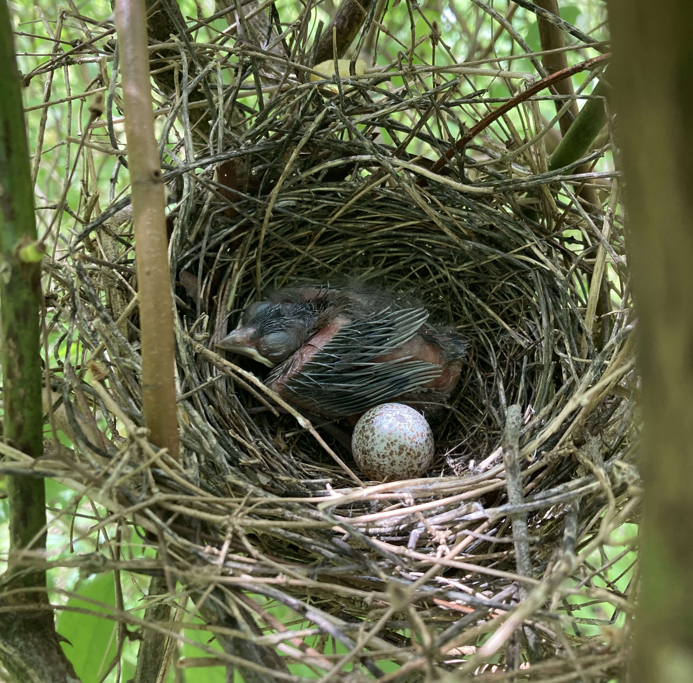

<br>

#### **Breeding performance of Northern Cardinals (*Cardinalis cardinalis*) across Urban Green Spaces differing in management**

Urban land management strategies are diverse and are implemented in different urban green spaces. A well-managed greenspace has the potential to support high vegetative diversity and provide habitat to a wide variety of invertebrate and avian species. The invasive amur honeysuckle (*Lonicera maackii*) is a dominant component of mid-story vegetation in eastern North American habitat where many songbirds, like the Northern Cardinal (*Cardinalis cardinalis*), preferentially nest. In this study, we assessed the  impact of variation in habitat management on all stages of nest success in the Northern Cardinals and discovered a significant reduction in growth rates and fledging success at the nestling stage.
<br>
<br>
```{r, echo=FALSE, fig.align='center', out.width='50%', fig.cap='Nestling *C. cardinalis* with unhatched egg'}

```